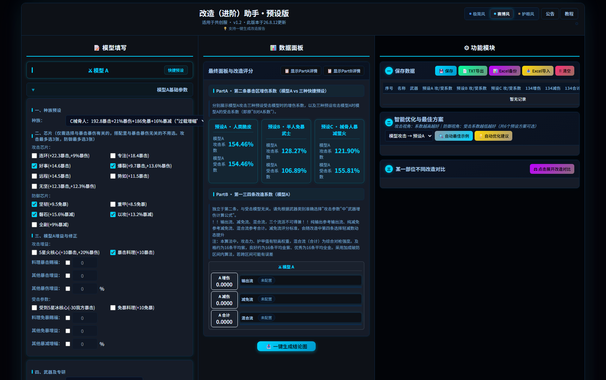
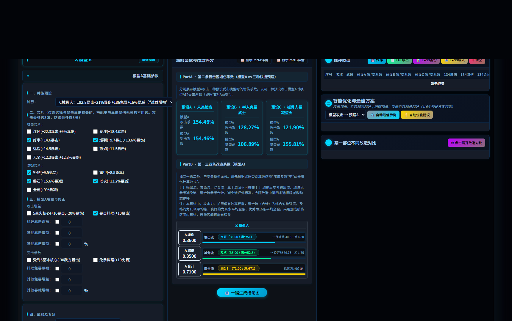

# 改造（进阶）助手 · 预设版

明日之后（LifeAfter）· 共创服 改造（进阶）助手 —— 单文件 HTML 数据计算器（单文件 HTML，双击即用；仅 Excel 导入导出用到一个 CDN 依赖）。
基于简单生存服改造系统，采用双模机制（内置常见模型，与自定义己方模型）

## 界面预览

| 主界面 | 数据面板 |
| :---: | :---: |
|  |  |

## 功能一览
- **皮肤切换**：赛博、复古、极简风格，任君挑选
- **模型填写**：种族 （已兼容械骨人）/ 芯片（已兼容6芯片） / 增益修正（可自行修正职业偏差） / 改造参数
- **数据面板**：暴击区增伤系数（模型 vs 三种快捷预设）· 第一三四条改造评分（输出流 / 减免流 / 混合流）
- **智能优化**：自动最佳示例（后台穷举）+ 边际收益优化建议
- **改造对比**：同一部位、两套改造方案逐项对照
- **一键结论图**：生成可分享的报告图片
- **记录管理**：保存 / 回填 / TXT / Excel 导入导出

## 使用

1. 下载 `index.html` 直接双击打开（推荐 Chrome / Edge）
2. 或部署到任意静态托管（如 GitHub Pages）在线使用
3. 在线预览：https://lespre.github.io/lifeafter-gaizao-assistant/

## 说明

- 仅供学习交流；数值口径以游戏内实测为准
- 记录保存在浏览器 localStorage，清缓存会丢失，重要数据请用 Excel 备份
